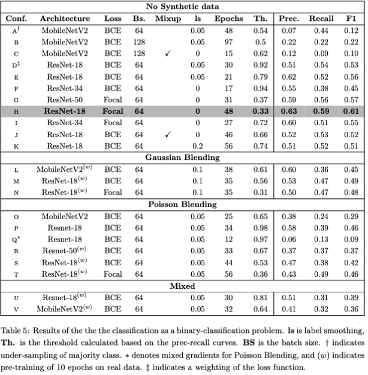
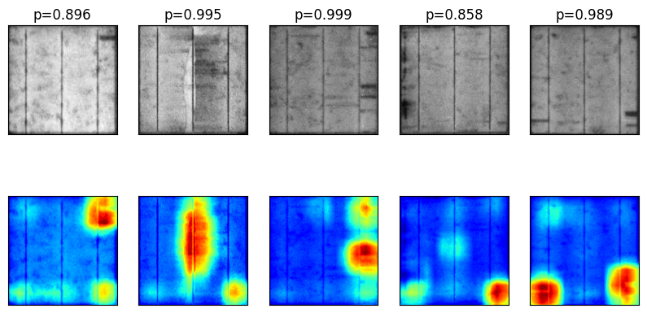

# Automating solar panel fault detection from image data
**Author**: Mads Andersen, s204137

**Mail**: s204137@dtu.dk

**University**: Technical University of Denmark

**Supervisors**: Søren Forchhammer, Claire Mantel and Allan Peter Engsig-Karup
## Overview
As the world transitions towards greener and more sustainable energy sources, maintenance challenges arise,
particularly in solar-based methods relying on photovoltaic panels for power generation. These panels, often
covering vast areas, are exposed to harsh conditions and require regular inspections to ensure optimal performance.
However, these manual inspections can be costly and pose a risk to the economic sustainability of solar power
utilization.

To address this issue, we propose a machine learning approach, specifically leveraging
Deep Convolutional Neural Networks (CNN), to automate the inspection process for solar panels.
Our research focuses on algorithmic and data-level regularization techniques to handle the inherent
class imbalance in the data. We explore the introduction of synthetic positive data and investigate
the effectiveness of weighted cross entropy and focal loss for algorithmic regularization.

## Dataset
We applied our method to a dataset consisting of 37,166 images of solar cells. The dataset represents a diverse
range of panel conditions, including normal and faulty panels. Each image is labeled to indicate the presence or
absence of faults.

## Results
After extensive experimentation and model evaluation, the highest achieved performance reached a precision
and recall of 0.62 and 0.61, respectively, resulting in an F1 score of 0.62. These results demonstrate the
potential of CNNs in automating the inspection process for solar panels.

Furthermore, our investigation into the use of synthetic data revealed that it did not significantly improve the overall performance. However, it did show promise in accelerating the convergence of certain architectures and achieving higher plateaus.

## Conclusion
In conclusion, our study demonstrates the feasibility of leveraging Deep Convolutional Neural Networks (CNN)
to automate the inspection of solar panels. While our approach achieved satisfactory performance, it is clear
that more data is required to reach higher performance levels and ensure a more robust predictor.

This GitHub repository contains the code used in our research. For data ask: s204137@dtu.dk

## Results

### Main Results 
The results are presented in the table below: 

### Class activation maps
The class activation maps for the best performing model are presented below:
